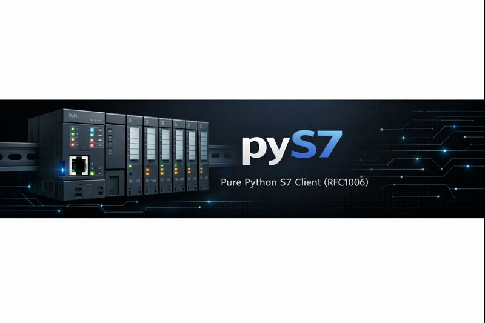

<div align="center">

# pyS7

<br/>

pyS7 is a lightweight, pure Python library that implements the Siemens S7 communication protocol over ISO-on-TCP (RFC1006). It enables direct communication with Siemens S7-200, S7-300, S7-400, S7-1200, and S7-1500 PLCs from Python applications.

**Production/Stable** • **2x Performance** • **Fully Tested**

> ⚠️ Neither this project nor its authors are affiliated with Siemens. S7-200, S7-300, S7-400, S7-1200, and S7-1500 are registered trademarks of Siemens AG.

</div>



## Features

- **Pure Python** – No external dependencies, easy installation across platforms
- **Intuitive API** – Clean, readable code with full typing support for IDE assistance
- **High Performance** – Optimized hot paths, 2x faster request preparation (v2.5.0)
- **Optimized multi-variable reads** – Automatically groups contiguous tags to reduce network requests
- **Automatic chunking** – Transparently splits large STRING/WSTRING reads exceeding PDU size
- **CPU diagnostics** – Read PLC status (RUN/STOP) and information (model, firmware) via SZL protocol
- **Broad compatibility** – Supports S7-200/300/400/1200/1500 series
- **Production Ready** – 187 tests, 82% coverage, strict type checking

## Safety Notice

Industrial safety must always remain your top priority. By using pyS7 you accept full responsibility for any damage, data loss, downtime, or unintended effects. Understand your system and the implications of each operation before interacting with live equipment.

## Installation

Requires Python 3.8 or later.

```bash
pip install pys7
```

Or install from GitHub:

```bash
pip install git+https://github.com/xtimmy86x/pyS7
```

## Quick Start

### Reading data

```python
from pyS7 import S7Client

with S7Client(address="192.168.5.100", rack=0, slot=1) as client:
    tags = [
        "DB1,X0.0",  # Bit 0 of DB1
        "DB1,I30",   # INT at byte 30 of DB1
        "M54.4",     # Bit 4 of marker memory
        "IW22",      # WORD at byte 22 of input area
        "QR24",      # REAL at byte 24 of output area
        "DB1,S10.5"  # String of 5 characters at byte 10 of DB1
    ]
    
    data = client.read(tags)
    print(data)  # [True, 123, True, 10, 3.14, 'Hello']
```

### Writing data

```python
from pyS7 import S7Client

with S7Client(address="192.168.5.100", rack=0, slot=1) as client:
    tags = ["DB1,X0.0", "DB1,I30", "DB1,R40", "DB1,S10.5"]
    values = [True, 25000, 1.2345, "Hello"]
    
    client.write(tags, values)
```

### Reading CPU status

```python
from pyS7 import S7Client

with S7Client(address="192.168.5.100", rack=0, slot=1) as client:
    # Get CPU status
    status = client.get_cpu_status()
    print(f"CPU Status: {status}")  # "RUN" or "STOP"

    # Get CPU information
    info = client.get_cpu_info()
    print(f"Model: {info['module_type_name']}")
    print(f"Firmware: {info['firmware_version']}")
    print(f"Hardware: {info['hardware_version']}")
```

See [docs/CPU_STATUS_READING.md](docs/CPU_STATUS_READING.md) for details.

### String data types

pyS7 supports both ASCII and Unicode strings:

```python
# STRING (ASCII) - All S7 models
tags = ["DB1,S10.20"]  # STRING at byte 10, max 20 chars
data = client.read(tags)
print(data[0])  # "Hello World"

# WSTRING (Unicode) - S7-1200/1500 only
tags = ["DB1,WS100.30"]  # WSTRING at byte 100, max 30 chars
data = client.read(tags)
print(data[0])  # "Hello 世界! 🌍"

# Large strings automatically chunked if exceeding PDU size
tags = ["DB1,S100.254"]  # STRING[254] - handled transparently
data = client.read(tags)  # Complete string returned
```

## Documentation

### Guides

- **[API Reference](docs/API_REFERENCE.md)** – Data types, address formats, supported operations
- **[Advanced Usage](docs/ADVANCED_USAGE.md)** – TSAP connections, PDU tuning, chunking, multi-threading
- **[Best Practices](docs/BEST_PRACTICES.md)** – Connection management, error handling, production deployment
- **[Troubleshooting](docs/TROUBLESHOOTING.md)** – Common issues and solutions

### Technical Documentation

- **[CPU Status Reading](docs/CPU_STATUS_READING.md)** – CPU diagnostics details
- **[CPU Info Technical Notes](docs/CPU_INFO_TECHNICAL_NOTES.md)** – CPU information internals
- **[Bit Read Troubleshooting](docs/TROUBLESHOOTING_BIT_READ.md)** – Bit operation guidance

### Quick Links

- [Supported address formats](docs/API_REFERENCE.md#supported-addresses) – Complete address mapping
- [TSAP connection](docs/ADVANCED_USAGE.md#tsap-connection) – Alternative connection method
- [PDU optimization](docs/ADVANCED_USAGE.md#pdu-size-management) – Performance tuning
- [Error handling](docs/BEST_PRACTICES.md#error-handling) – Robust error patterns
- [Connection issues](docs/TROUBLESHOOTING.md#connection-issues) – Can't connect?

## Examples

Example scripts in the [`examples/`](examples/) directory demonstrate:

- `read_data.py` – Basic reading operations
- `write_data.py` – Basic writing operations
- `get_cpu_status.py` – CPU status monitoring
- `get_cpu_info.py` – CPU information retrieval
- `read_data_tsap.py` – TSAP connection example
- `bit_read_workaround.py` – Bit operations
- `manage_reconnection.py` – Connection handling

## License

This project is distributed under the MIT License. See the [LICENSE](LICENSE) file for details.

## Acknowledgements

Special thanks to [filocara](https://github.com/FiloCara) for the original project that inspired this work.
